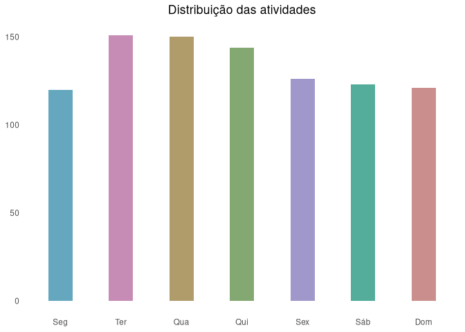
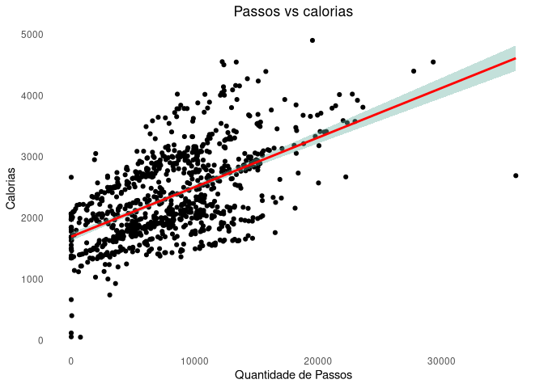
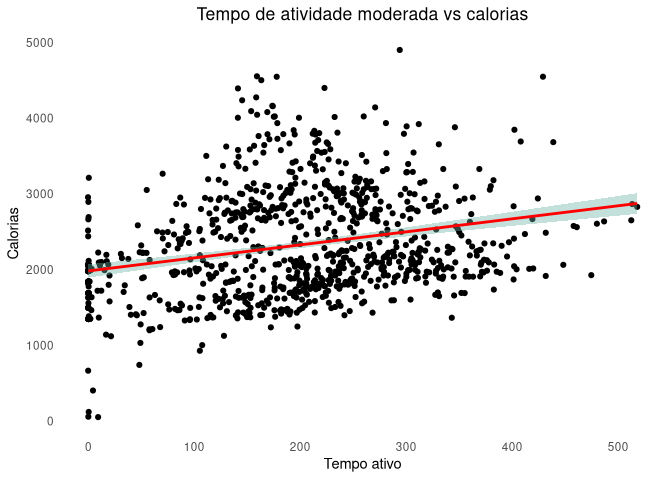
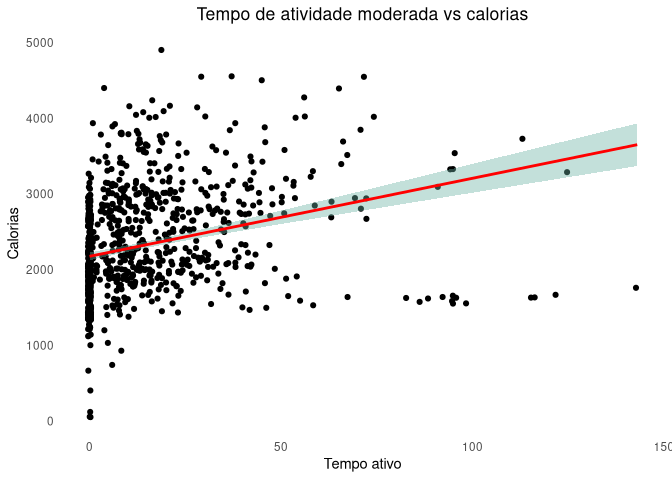
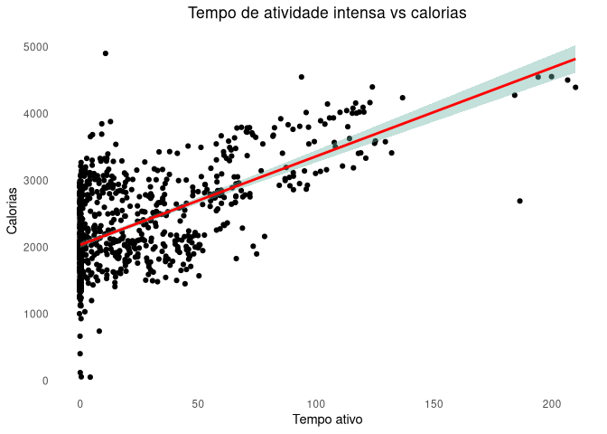
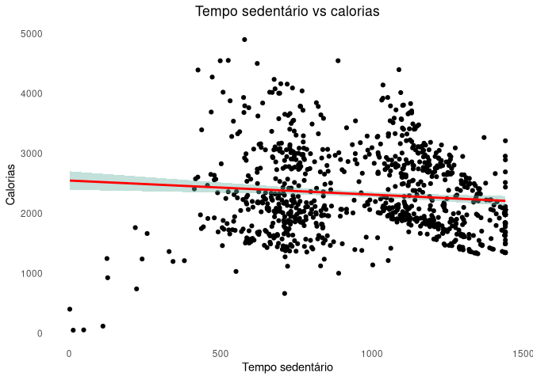
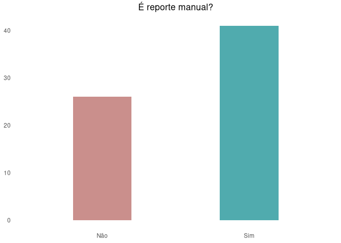

Estudo de caso - Bellabeat
================
Raphael Lopes
2024-01-31

Estudo de caso abordado, como cumprimento ao pré-requisito para obtenção
de certificação Google Data Analyst.

Este caso aborda o caso da Bellabeat - fabricante de produtos de
tecnologia voltada à saúde feminina. Ela é uma empresa inciando a adoção
do data driven, e solicita que seja realizada a análise de como
consumidores utilizam dispositivos inteligentes que não são da
companhia - e aplicar o conhecimento obtido a partir desta análise para
comparar com um dos produtos do portfólio.

Entre os seus produtos, há o **Time** - um relógio de bem-estar, o qual
combina a aparência atemporal de um relógio clássico com tecnologia, a
fim de rastrear a atividade, sono e estresse do usuário. Este produto se
conecta ao aplicativo Bellabeat para transmitir informações sobre o
bem-estar do usuário.

De acordo com a metodologia do Google, a análise de dados compreende
seis etapas:

1.  Perguntar
2.  Preparar
3.  Processar
4.  Analisar
5.  Compartilhar
6.  Agir

Cada um destes processos será abordado nos tópicos a seguir.

## Preparação do ambiente

### Instalar bibliotecas

``` r
#install.packages("tidyverse", type = 'source')
```

### Importar bibliotecas

``` r
library(tidyverse)
library(readr)
library(dplyr)
library(ggplot2)
library(grid)
```

## Perguntar

As perguntas que fomentam esta análise são:

- *Quais são algumas tendências no uso de dispositivos inteligentes?*

- *Como essas tendências podem se aplicar aos clientes da Bellabeat?*

- *Como essas tendências podem ajudar a influenciar a estratégia de
  marketing da Bellabeat?*

Dadas estas perguntas, estabeleceu-se a seguinte declaração de tarefa de
negócio:

***Como utilizar as informações obtidas para otimizar o marketing do
produto time?***

## Preparar

### Fonte dos dados

Os dados utilizados nesta análise são oriundos do dataset “FitBit
Fitness Tracker Data”, disponível no Kaggle, acessível clicando
[aqui](https://www.kaggle.com/datasets/arashnic/fitbit).

Ele é um projeto CC0, de domínio público - o qual contém registros de
condicionamento físico de 30 usuários do Fitbit. Esses registros incluem
informações sobre período de atívidade física, frequência cardíaca e
monitoramento do sono.

O tamanho da amostra de 30 indivíduos é considerado um tamanho
aceitável. Todavia é recomendável em futuras análises aumentar o tamanho
da amostra, de forma a aumentar a confiabilidade da análise.

Desta fonte de dados foram utilizados cinco arquivos de extensão csv,
sendo eles:

- dailyActivity_merged
- hourlyCalories_merged
- hourlyIntensities_merged
- sleepDay_merged
- weightLogInfo_merged

### Filtragem

Antes de importar os arquivos para o markdown, foi detectada a
necessidade de filtrar valores inconsistentes nos arquivos. Essas
removoções são realizadas no tópico Transformação. Das informações
removidas, cita-se:

#### dailyActivity_merged

- 4 registros de calorias com valor 0;
- 1 registro de consumo de calorias basal (O consumo calórico também
  apresentava inconsistência).

### Importando os dados

``` r
daily_activity <- read_csv("data/dailyActivity_merged.csv")
hourly_calories <- read_csv("data/hourlyCalories_merged.csv")
hourly_intensities <- read_csv("data/hourlyIntensities_merged.csv")
sleep_day <- read_csv("data/sleepDay_merged.csv")
weight_log <- read_csv("data/weightLogInfo_merged.csv")
```

### Transformação

``` r
daily_activity <- daily_activity %>%
  filter(Calories != 0 & SedentaryMinutes != 0)
```

#### Obtém dias da semana

``` r
daily_activity <- daily_activity %>%
  mutate(dayWeek = str_to_sentence(wday(mdy(ActivityDate), label = TRUE)))
```

#### Obtém horas

``` r
hourly_calories <- hourly_calories %>%
  mutate(hours = hour(strptime(ActivityHour, '%m/%d/%Y %H:%M')) %>% as.character())
```

#### Obtém se é reporte manual

``` r
weight_log <- weight_log %>%
  mutate(IsManual = if_else(IsManualReport, "Sim", "Não"))
```

### Exibe detalhes de cada fonte

#### daily_activity

``` r
head(daily_activity)
```

    ## # A tibble: 6 × 16
    ##           Id ActivityDate TotalSteps TotalDistance TrackerDistance
    ##        <dbl> <chr>             <dbl>         <dbl>           <dbl>
    ## 1 1503960366 4/12/2016         13162          8.5             8.5 
    ## 2 1503960366 4/13/2016         10735          6.97            6.97
    ## 3 1503960366 4/14/2016         10460          6.74            6.74
    ## 4 1503960366 4/15/2016          9762          6.28            6.28
    ## 5 1503960366 4/16/2016         12669          8.16            8.16
    ## 6 1503960366 4/17/2016          9705          6.48            6.48
    ## # ℹ 11 more variables: LoggedActivitiesDistance <dbl>,
    ## #   VeryActiveDistance <dbl>, ModeratelyActiveDistance <dbl>,
    ## #   LightActiveDistance <dbl>, SedentaryActiveDistance <dbl>,
    ## #   VeryActiveMinutes <dbl>, FairlyActiveMinutes <dbl>,
    ## #   LightlyActiveMinutes <dbl>, SedentaryMinutes <dbl>, Calories <dbl>,
    ## #   dayWeek <chr>

#### hourly_calories

``` r
head(hourly_calories)
```

    ## # A tibble: 6 × 4
    ##           Id ActivityHour          Calories hours
    ##        <dbl> <chr>                    <dbl> <chr>
    ## 1 1503960366 4/12/2016 12:00:00 AM       81 12   
    ## 2 1503960366 4/12/2016 1:00:00 AM        61 1    
    ## 3 1503960366 4/12/2016 2:00:00 AM        59 2    
    ## 4 1503960366 4/12/2016 3:00:00 AM        47 3    
    ## 5 1503960366 4/12/2016 4:00:00 AM        48 4    
    ## 6 1503960366 4/12/2016 5:00:00 AM        48 5

#### hourly_intensities

``` r
head(hourly_intensities)
```

    ## # A tibble: 6 × 4
    ##           Id ActivityHour          TotalIntensity AverageIntensity
    ##        <dbl> <chr>                          <dbl>            <dbl>
    ## 1 1503960366 4/12/2016 12:00:00 AM             20            0.333
    ## 2 1503960366 4/12/2016 1:00:00 AM               8            0.133
    ## 3 1503960366 4/12/2016 2:00:00 AM               7            0.117
    ## 4 1503960366 4/12/2016 3:00:00 AM               0            0    
    ## 5 1503960366 4/12/2016 4:00:00 AM               0            0    
    ## 6 1503960366 4/12/2016 5:00:00 AM               0            0

#### sleep_day

``` r
head(sleep_day)
```

    ## # A tibble: 6 × 5
    ##           Id SleepDay        TotalSleepRecords TotalMinutesAsleep TotalTimeInBed
    ##        <dbl> <chr>                       <dbl>              <dbl>          <dbl>
    ## 1 1503960366 4/12/2016 12:0…                 1                327            346
    ## 2 1503960366 4/13/2016 12:0…                 2                384            407
    ## 3 1503960366 4/15/2016 12:0…                 1                412            442
    ## 4 1503960366 4/16/2016 12:0…                 2                340            367
    ## 5 1503960366 4/17/2016 12:0…                 1                700            712
    ## 6 1503960366 4/19/2016 12:0…                 1                304            320

#### weight_log

``` r
head(weight_log)
```

    ## # A tibble: 6 × 9
    ##       Id Date  WeightKg WeightPounds   Fat   BMI IsManualReport   LogId IsManual
    ##    <dbl> <chr>    <dbl>        <dbl> <dbl> <dbl> <lgl>            <dbl> <chr>   
    ## 1 1.50e9 5/2/…     52.6         116.    22  22.6 TRUE           1.46e12 Sim     
    ## 2 1.50e9 5/3/…     52.6         116.    NA  22.6 TRUE           1.46e12 Sim     
    ## 3 1.93e9 4/13…    134.          294.    NA  47.5 FALSE          1.46e12 Não     
    ## 4 2.87e9 4/21…     56.7         125.    NA  21.5 TRUE           1.46e12 Sim     
    ## 5 2.87e9 5/12…     57.3         126.    NA  21.7 TRUE           1.46e12 Sim     
    ## 6 4.32e9 4/17…     72.4         160.    25  27.5 TRUE           1.46e12 Sim

## Processar

Foi verificada necessidade de formatar os campos de data/data e hora dos
datasets, a fim de viabilizar a análise.

``` r
daily_activity <- daily_activity %>%
  mutate(ActivityDate = mdy(ActivityDate))
hourly_calories <- hourly_calories %>%
  mutate(ActivityHour = mdy_hms(ActivityHour))
hourly_intensities <- hourly_intensities %>%
  mutate(ActivityHour = mdy_hms(ActivityHour))
sleep_day <- sleep_day %>%
  mutate(SleepDay = mdy_hms(SleepDay))
weight_log <- weight_log %>%
  mutate(Date = mdy_hms(Date))
```

## Analisar

### Distribuição dos dados e medidas de tendência central

``` r
daily_activity %>% 
  select(TotalSteps, TotalDistance, LightlyActiveMinutes, FairlyActiveMinutes, VeryActiveMinutes, SedentaryMinutes, Calories) %>%
  summary()
```

    ##    TotalSteps    TotalDistance    LightlyActiveMinutes FairlyActiveMinutes
    ##  Min.   :    0   Min.   : 0.000   Min.   :  0.0        Min.   :  0.00     
    ##  1st Qu.: 3832   1st Qu.: 2.650   1st Qu.:128.5        1st Qu.:  0.00     
    ##  Median : 7443   Median : 5.270   Median :199.0        Median :  7.00     
    ##  Mean   : 7679   Mean   : 5.519   Mean   :193.8        Mean   : 13.64     
    ##  3rd Qu.:10734   3rd Qu.: 7.720   3rd Qu.:264.5        3rd Qu.: 19.00     
    ##  Max.   :36019   Max.   :28.030   Max.   :518.0        Max.   :143.00     
    ##  VeryActiveMinutes SedentaryMinutes    Calories   
    ##  Min.   :  0.00    Min.   :   2.0   Min.   :  52  
    ##  1st Qu.:  0.00    1st Qu.: 729.5   1st Qu.:1836  
    ##  Median :  4.00    Median :1057.0   Median :2148  
    ##  Mean   : 21.28    Mean   : 990.4   Mean   :2316  
    ##  3rd Qu.: 32.00    3rd Qu.:1226.0   3rd Qu.:2795  
    ##  Max.   :210.00    Max.   :1440.0   Max.   :4900

1.  É notável que a maior parte do uso está concentrado em indivíduos
    sedentários, bem como a maior parte dos usos são feitos em
    atividades mais leves.  
2.  Poucos usuários realizam atividades pesadas, o que promove uma
    distorção entre o terceiro quadrante e o valor máximo observado.

``` r
hourly_calories %>% 
  select(Calories) %>%
  summary()
```

    ##     Calories     
    ##  Min.   : 42.00  
    ##  1st Qu.: 63.00  
    ##  Median : 83.00  
    ##  Mean   : 97.39  
    ##  3rd Qu.:108.00  
    ##  Max.   :948.00

1.  O máximo confirma a informação observada no dataset anterior.

``` r
hourly_intensities %>% 
  select(TotalIntensity, AverageIntensity) %>%
  summary()
```

    ##  TotalIntensity   AverageIntensity
    ##  Min.   :  0.00   Min.   :0.0000  
    ##  1st Qu.:  0.00   1st Qu.:0.0000  
    ##  Median :  3.00   Median :0.0500  
    ##  Mean   : 12.04   Mean   :0.2006  
    ##  3rd Qu.: 16.00   3rd Qu.:0.2667  
    ##  Max.   :180.00   Max.   :3.0000

1.  Essas informações confirmam que a maior parte dos usuários focam em
    atividades leves, com baixo consumo calórico.

``` r
sleep_day %>% 
  select(-Id, -SleepDay) %>%
  summary()
```

    ##  TotalSleepRecords TotalMinutesAsleep TotalTimeInBed 
    ##  Min.   :1.000     Min.   : 58.0      Min.   : 61.0  
    ##  1st Qu.:1.000     1st Qu.:361.0      1st Qu.:403.0  
    ##  Median :1.000     Median :433.0      Median :463.0  
    ##  Mean   :1.119     Mean   :419.5      Mean   :458.6  
    ##  3rd Qu.:1.000     3rd Qu.:490.0      3rd Qu.:526.0  
    ##  Max.   :3.000     Max.   :796.0      Max.   :961.0

1.  Os dados demonstram que a maior parte dos usuários dormem entre 7 a
    8 horas por dia, valores considerados bons para a saúde.

``` r
weight_log %>% 
  select(WeightKg, Fat, BMI) %>%
  summary()
```

    ##     WeightKg           Fat             BMI       
    ##  Min.   : 52.60   Min.   :22.00   Min.   :21.45  
    ##  1st Qu.: 61.40   1st Qu.:22.75   1st Qu.:23.96  
    ##  Median : 62.50   Median :23.50   Median :24.39  
    ##  Mean   : 72.04   Mean   :23.50   Mean   :25.19  
    ##  3rd Qu.: 85.05   3rd Qu.:24.25   3rd Qu.:25.56  
    ##  Max.   :133.50   Max.   :25.00   Max.   :47.54  
    ##                   NA's   :65

1.  Os dados indicam valores muito altos de percentual de gordura.
2.  Destaca-se a quantidade de nulos no BMI(Índice de massa corporal em
    portugês), indicando que esta medição não ocorre para indivíduos com
    percentual de gordura inferior a 20%. Isto pode gerar viés quando da
    análise, sendo recomendável mudar a metologia de coleta deste dado.
3.  Em virtude da insuficiência de dados, este dataset será descartado
    nas fases seguintes.

## Compartilhar

### Dias da semana com mais atividades

``` r
days_of_week <- c('Seg', 'Ter', 'Qua', 'Qui', 'Sex', 'Sáb', 'Dom')
```

``` r
ggplot(daily_activity, aes(x = factor(dayWeek, days_of_week), fill = dayWeek)) +
  geom_bar(stat = 'count', width = 0.4, show.legend = FALSE) +
  scale_fill_hue(c = 40) +
  theme_minimal() +
  theme(panel.grid.major = element_blank(),
        panel.grid.minor = element_blank(),
        axis.title.x = element_blank(),
        axis.title.y = element_blank(),
        plot.title = element_text(hjust = 0.5)) +
  ggtitle("Distribuição das atividades")
```

<!-- -->

1.  Dias úteis são aqueles com tendência de atividade maior por parte
    dos usuários, quando comparados aos finais de semana, em especial de
    terça à quinta-feira.

### Queima de caloria por passos

``` r
ggplot(daily_activity, aes(x = TotalSteps, y = Calories)) +
  geom_jitter() +
  geom_smooth(method = lm, color = "red", fill="#69b3a2", se=TRUE) + 
  theme_minimal() +
  theme(panel.grid.major = element_blank(),
        panel.grid.minor = element_blank(),
        plot.title = element_text(hjust = 0.5)) +
  labs(title = "Passos vs calorias",
       x = "Quantidade de Passos",
       y = "Calorias")
```

<!-- -->

1.  Há uma forte correlação entre a quantidade de passos realizados
    pelos usuários, em comparação a quantidade de calorias utilizadas
    durante a atividade.

### Queima de caloria por tempo de uso do aplicativo

``` r
ggplot(daily_activity, aes(x = LightlyActiveMinutes, y = Calories)) +
  geom_jitter() +
  geom_smooth(method = lm, color = "red", fill="#69b3a2", se=TRUE) + 
  theme_minimal() +
  theme(panel.grid.major = element_blank(),
        panel.grid.minor = element_blank(),
        plot.title = element_text(hjust = 0.5)) +
  labs(title = "Tempo de atividade moderada vs calorias",
       x = "Tempo ativo",
       y = "Calorias")
```

<!-- -->

``` r
ggplot(daily_activity, aes(x = FairlyActiveMinutes, y = Calories)) +
  geom_jitter() +
  geom_smooth(method = lm, color = "red", fill="#69b3a2", se=TRUE) + 
  theme_minimal() +
  theme(panel.grid.major = element_blank(),
        panel.grid.minor = element_blank(),
        plot.title = element_text(hjust = 0.5)) +
  labs(title = "Tempo de atividade moderada vs calorias",
       x = "Tempo ativo",
       y = "Calorias")
```

<!-- -->

``` r
ggplot(daily_activity, aes(x = VeryActiveMinutes, y = Calories)) +
  geom_jitter() +
  geom_smooth(method = lm, color = "red", fill="#69b3a2", se=TRUE) + 
  theme_minimal() +
  theme(panel.grid.major = element_blank(),
        panel.grid.minor = element_blank(),
        plot.title = element_text(hjust = 0.5)) +
  labs(title = "Tempo de atividade intensa vs calorias",
       x = "Tempo ativo",
       y = "Calorias")
```

<!-- -->

1.  Existe baixa diferença de queima de calorias entre usuários que usam
    o aplicativo para atividades de baixa e moderada intensidade.
2.  Já para usuários que realizam atividades com alta intensidade, a
    queima calórica é mais acentuada.

### Período sedentário vs calorias

``` r
ggplot(daily_activity, aes(x = SedentaryMinutes, y = Calories)) +
  geom_jitter() +
  geom_smooth(method = lm, color = "red", fill="#69b3a2", se=TRUE) + 
  theme_minimal() +
  theme(panel.grid.major = element_blank(),
        panel.grid.minor = element_blank(),
        plot.title = element_text(hjust = 0.5)) +
  labs(title = "Tempo sedentário vs calorias",
       x = "Tempo sedentário",
       y = "Calorias")
```

<!-- -->

1.  O período sedentário aparenta influenciar pouco na queima de
    calorias.

### Reporte manual vs automatizado

``` r
ggplot(weight_log, aes(x = IsManual, fill = IsManual)) +
  geom_bar(stat = 'count', width = 0.4, show.legend = FALSE) +
  scale_fill_hue(c = 40) +
  theme_minimal() +
  theme(panel.grid.major = element_blank(),
        panel.grid.minor = element_blank(),
        axis.title.x = element_blank(),
        axis.title.y = element_blank(),
        plot.title = element_text(hjust = 0.5)) +
  ggtitle("É reporte manual?")
```

<!-- -->

1.  A maior parte dos reportes realizados são manuais, o que pode levar
    os usuários a esquerem de preencher as informações, ou preencherem
    informações imprecisas no aplicativo.

## Agir

Dada mensagem de negócio, podem ser estabelecidas as seguintes
recomendações:

1.  A maior parte dos usuários tendem a ser aqueles que realizam
    atividade física de baixa intensidade. Campanhas de marketing
    orientadas a este público tendem a ser mais eficazes para atrair
    novos clientes.

2.  Clientes com atividade física mais intensa tendem a obter melhores
    resultados. Campanhas orientadas a fidelizar, ou oferecer
    atendimento diferenciado a este público pode especializar o produto
    para este nicho, o qual tende a despender mais recursos financeiros
    em performance.

3.  Devem ser promovidas as funcionalidades que utilizam reportes
    automatizados, dado que eles facilitam a vida do usuário e agregam
    valor ao aplicativo.

4.  Podem ser focadas campanhas entre as terças e quintas, visto que
    possíveis usuários estão mais propensos a pesquisarem sobre o tema
    nestes dias.

5.  Os dados relativos à percentual de gordura no momento são
    insuficientes. Em futuras coletas de dados, é necessário rever a
    metodologia de obtenção, para que a análise não gere viés. Este é um
    dado fundamental que pode gerar diferencial para a aplicação.

Grato pela atenção!
